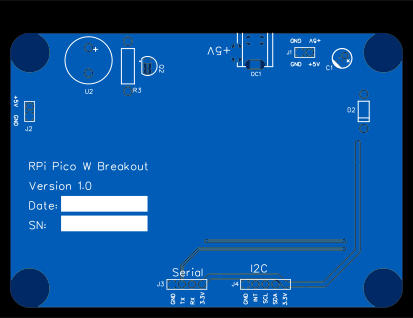
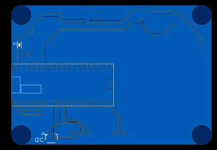

# RPi Pico W Breakout

A small breakout board for the RPi Pico W. Not all the pins are broken out, just a few I found useful. The board is inteneded to be use in projects where the Pico W is used as a wireless microcontroller and powered from a plug pack.

TODO: Add photo of completed board

## Licence

Copyright © 2024 Phil Baldwin

This work is licensed under a Creative Commons Attribution-ShareAlike 4.0 International License.

You should have received a copy of the license along with this work. If not, see <http://creativecommons.org/licenses/by-sa/4.0/>.
